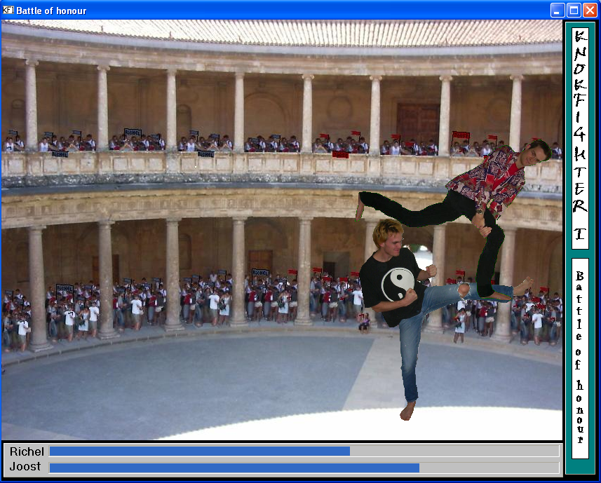
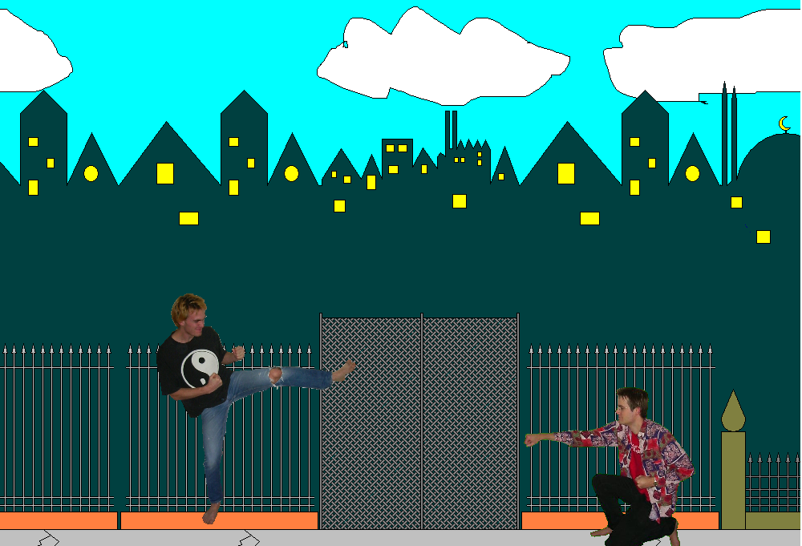

# KnokFighter

* [Go to the nicer looking website](http://richelbilderbeek.github.io/Knokfighter)

The game KnokFighter using the C++ VCL library.

Programmed by Joost van den Bogaart and Richel Bilderbeek.

 * [Storyline (pdf)](KnokFighterStory_1_0.pdf)
 * [Storyline (ppt)](KnokFighterStory_1_0.ppt)

